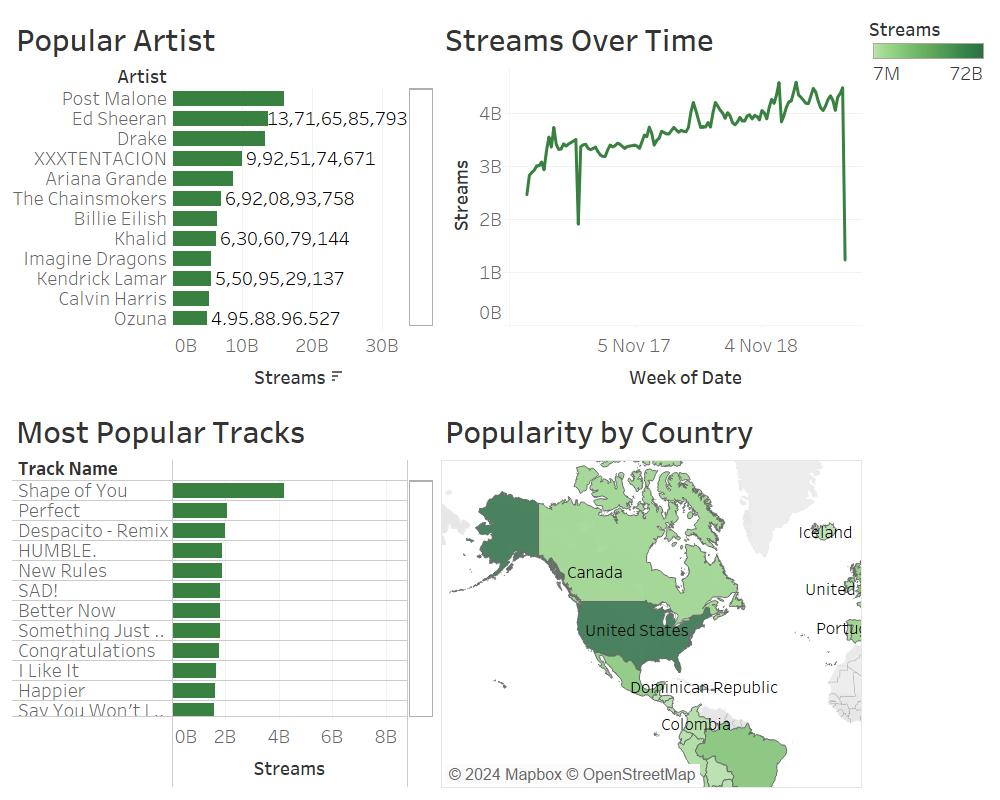

# Spotify-Data-Visualization - 
Visualized Spotify data for all available countries from January 2017 to July 2019. 

Check on [Tableau Public](https://public.tableau.com/views/Spotify_Daily_Streaming_Visualization/Popularity?:language=en-US&:display_count=n&:origin=viz_share_link).

## Tableau Dashboards
 

	  

	 <br

## Reference 
- https://charts.spotify.com/home
- https://www.tableau.com/blog/how-visualize-spotify-music-trends-tableau
